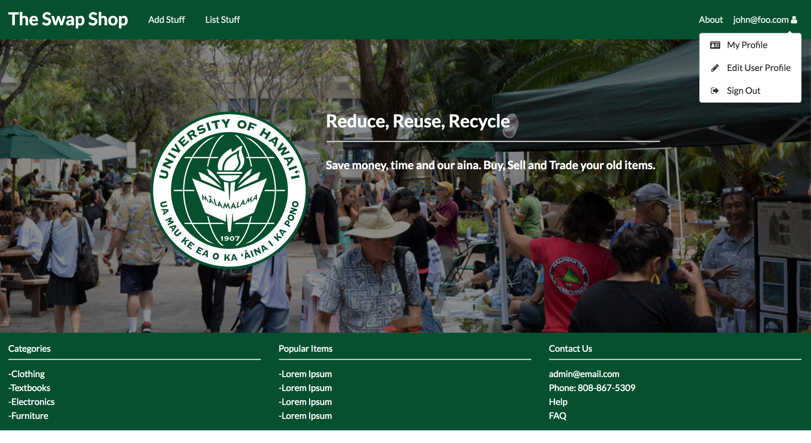
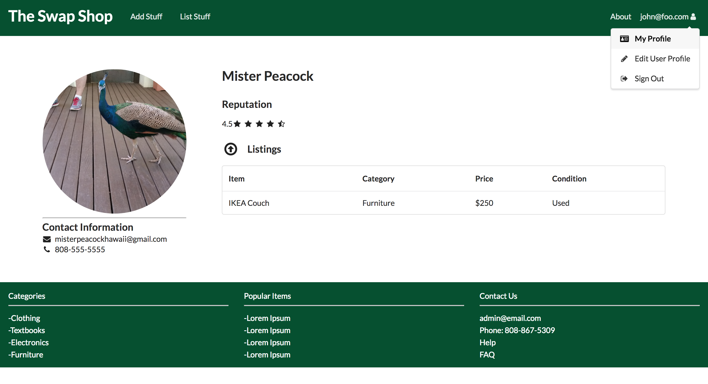

# Table of Contents

* [About The Manoa Swap Shop](#about-the-manoa-swap-shop)
* [Development goals](#development-goals)

# About The Manoa Swap Shop

The Manoa Swap Shop is a Meteor application that provides a safe environment for University of Hawaii at Manoa students and faculty to exchange school related goods and services.

# Development goals

We want to provide UHM students and faculty with a simple application that allows them to safely exchange goods.  We plan to implement:

* User accounts for students and faculty
* Administrator accounts for moderators
* Listing page for offered goods and services, sorted by categories
* Listing page for wanted goods and services, sorted by categories
* A search function for users to search for goods
* A listing feature for users to add their goods to the listing page
* Pre-designated meeting locations for student and faculty safety.

# Page layout and design

Upon arrival at the website, the user will see the following landing page.

# MileStone 1

* Landing Page
* About Page
* Login and SignUp Page
* User profile page
* User Home Page

[GitHub Organization Link](https://github.com/manoaswapshop)
 
[GitHub Milestone Project Link](https://github.com/manoaswapshop/swapshop_source/projects/1)

[Landing Page MockUp](http://themanoaswapshop.meteorapp.com/#/)

[About Page MockUp](http://themanoaswapshop.meteorapp.com/#/about)

[User Home Page MockUp](http://themanoaswapshop.meteorapp.com/#/)

[User Profile MockUp](http://themanoaswapshop.meteorapp.com/#/userprofile)

[Edit User Profile MockUp](http://themanoaswapshop.meteorapp.com/#/editprofile)

# Milestone 2
Click [here](https://github.com/manoaswapshop/swapshop_source/projects/2) to see a list of Milestone 2 issues and goals.
* Item Category Pages
* Item Listing Creation
* Linked Item Cards
* Admin Tools
* Setup User Collection for User Profile Pages
* Create User Profile Page
* Edit Profile Functionality

