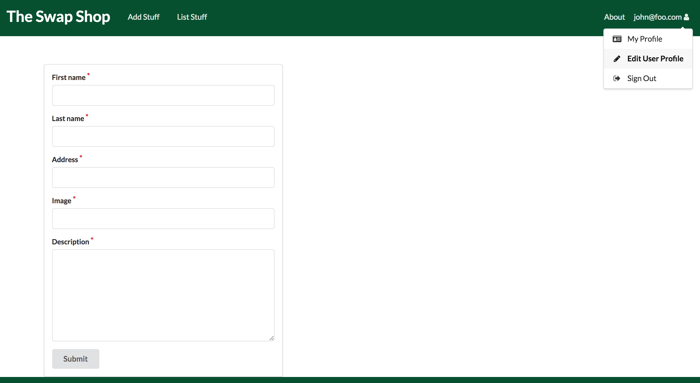
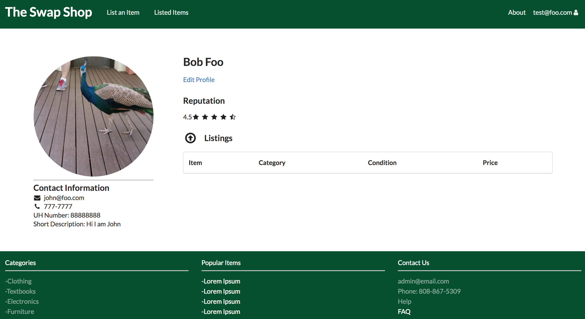

*Click [here](https://github.com/manoaswapshop) to view our GitHub organization page.*
# Table of Contents

* [About The Manoa Swap Shop](#about-the-manoa-swap-shop)
* [Installation Guide](#installation-guide)
* [Development goals](#development-goals)
* [Milestone 1](#milestone-1)

# About The Manoa Swap Shop

The Manoa Swap Shop is a Meteor application that provides a safe environment for University of Hawaii at Manoa students and faculty to exchange school related goods and services.

Click [here](http://themanoaswapshop.meteorapp.com/#/) to see the running deployment of our system hosted on Galaxy.

# Installation Guide

1. Install [Meteor](https://www.meteor.com/install)
2. Download a copy of [The Manoa Swap Shop](https://github.com/manoaswapshop/swapshop_source) from the GitHub page.  The repository is private so you will need to request for access from the authors.
3. Open up a terminal on your operating system and cd into the app directory of digits.  Run the command:
`$ meteor npm install`
4. Once you have installed the libraries, run the command:
`$ meteor npm run start`

This will start the application, which you can see at [http://localhost:3000](http://localhost:3000/).

Lastly, you can run ESLint over the code in the imports/ directory with:

`$ meteor npm run lint`

# Development goals

We want to provide UHM students and faculty with a simple application that allows them to safely exchange goods.  We plan to implement:

* User accounts for students and faculty
* Administrator accounts for moderators
* Listing page for offered goods and services, sorted by categories
* Listing page for wanted goods and services, sorted by categories
* A search function for users to search for goods
* A listing feature for users to add their goods to the listing page
* Pre-designated meeting locations for student and faculty safety.

# MileStone 1

Click [here](https://github.com/manoaswapshop/swapshop_source/projects/1) to see a list of Milestone 1 issues and goals.
* Landing Page
* About Page
* Login and SignUp Page
* User profile page
* User Home Page 

Upon arriving at the website, the user will see the following
[landing page.](http://themanoaswapshop.meteorapp.com/#/)

A brief description of our application can be found on the [about page.](http://themanoaswapshop.meteorapp.com/#/about)

When the user [signs in](http://themanoaswapshop.meteorapp.com/#/) to their account, additional options will appear in the navigation bar at the top of the page.

The user may view [their profile](http://themanoaswapshop.meteorapp.com/#/userprofile) once they have logged into their account.  On this page, the user's contact information will be displayed along with a listing of their items.

The user may also choose to [edit their profile](http://themanoaswapshop.meteorapp.com/#/editprofile) should any of the information provided becomes outdated.

# Milestone 2
Click [here](https://github.com/manoaswapshop/swapshop_source/projects/2) to see a list of Milestone 2 issues and goals.
* Item Category Pages
* Item Listing Creation
* Linked Item Cards
* Admin Tools
* Setup User Collection for User Profile Pages
* Create User Profile Page
* Edit Profile Functionality

1. To begin usage of the Manoa Swap Shop application, you must sign up for a new account. Immediately after you sign up, a User Profile Creation Page will pop up that will add your information into your user profile.

Once you have submitted your information the User Profile page will update to show all the changes that were added.

2. Now you have your user profile set up! If you made any errors you can always fix anything in your user profile by clicking on the edit button in the User Profile Page. This edit button will take you to an Edit Profile Page where you can make changes to any of the previously submitted fields.

After you submit your changes on the edit page your user profile page will update with these changes.

3. Onto the items part of the app. If you click on the "List an Item" in the nav bar it will take you to a page where you can create a new item listing. 

Once you have filled out all of the required fields and submitted, the item that you have just listed will show up on the Listed Items page.

In addition, all of the items that you yourself have listed will show up on your user profile page.

